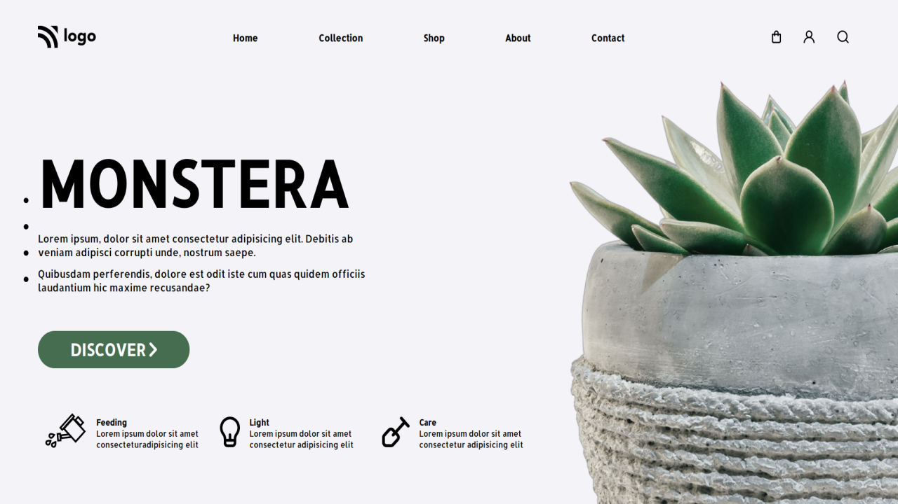

# Project 6

## `Nishok Maharaaj`

## Learnings    

In the sixth project of HTML and CSS class I have learnt more about position in CSS which is used mostly in alignment of the image and the text. Took lot of research to fine tune the positioning.

## [Project Live Link](https://github.com/nishok19/html-css-proj-6)

## Efforts

This project took around 3 hours to build. Aligning the cards, image took most of the time.

### Screenshot

